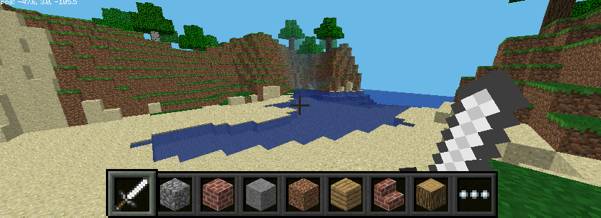
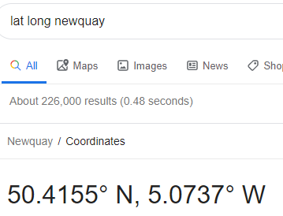
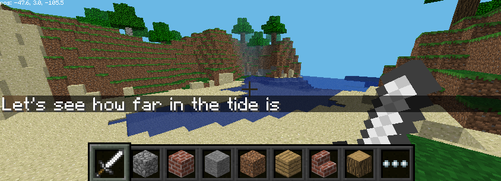
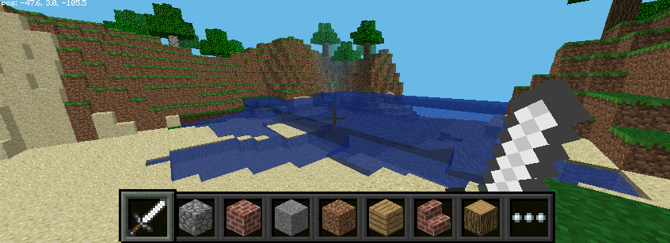
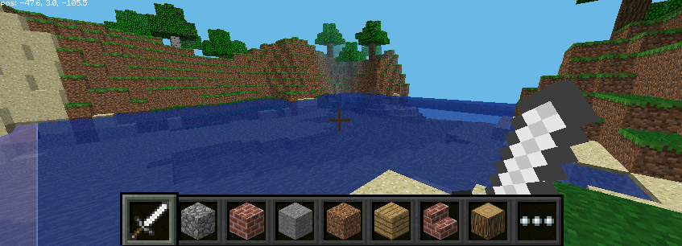

# Minecraft-Tides
Bring the real world state of the tide into Minecraft by raising the water levels. Living by the sea the state of the
tide is always present. Is if safe to go for a walk? Will the beach be there when we arrive or for how long?
So here is an exercise that retrieves the tide level online and places it into the game of Minecraft.

# Current State of Tide in Minecraft

Minecraft despite it’s blocky nature can be quite realistic. But one thing that doesn’t change is the water. 

What would happen if the tide came in?

This exercise in Python with Minecraft Pi  will gather the current tide height for a coastline near you, calculate 
if the tide is high or low and then flood Minecraft accordingly.



## Information Required
To find the state of the tide, whether it is in or out, requires two pieces of information. The time and location. 
Google can give you the latitude and longitude location. Just type “lat long placeName” into the search bar.



Then the actual tide information can be fetched from worldtidesinfo.com. This does require signing up for and creating 
an account. There is a charge if a lot of data is fetched but that is over 100 calls at the time of writing.

Once signed up find your API key. This will be needed to gather the tide information.


## Start Coding
Open Minecraft Pii and start a game. Don’t maximise the screen but keep the game to one side. Find somewhere with some 
water, preferably a sea, with a decent height of shoreline. Tides will rise and fall a few metres and in Minecraft one 
metre is one block. The code will presume that a low tide is as it is in the game. So any tide higher than low will 
flood the game. Quite substantially. So stand somewhere high. Press tab to leave the game running but to regain 
control of the mouse.

Also open a copy of Thonny IDE to program in Python. On a new blank tab enter the following code.
```
from mcpi import minecraft
from mcpi import block

# Make link into Minecraft
mc=minecraft.Minecraft.create()

mc.postToChat("Here is your position")

x,y,z = mc.player.getTilePos()

mc.postToChat(x)
mc.postToChat(y)
mc.postToChat(z)
```

Save this code and run with the arrow key on Thonny. The message and player position should show on the Minecraft game.

### Didn’t Work
Did you leave the Minecraft by clicking tab as instructed? Look out for Capital leTters in the right places. 
Very important in Python. And also missing brackets().

## Getting the Tide Height

The Worldtides website a lot of information can be extracted about the tide information for your chosen location 
or closest available. All you require for this exercise is the height for right now.

At the worldtides.info website sign up and get your Application Programming Interface (API) key. This will be needed 
to receive the information. 

The normal look up will give the next days values for the tides. But it is easy to get just a single value.

Open a new Thonny tab and save this as get_tides.py. This code shows how to use the API to get the information required. 
The address= line takes all the information, time_now, latitude and longitude and makes it into one address line. 
Don’t forget to replace myKey with your API key. To do this all these values need to be strings of text not numbers. 
So the str() function turns digits into letters.
```
from time import time
import requests

# Calculate the unix epoch time from Jan 1st 1070

time_now = str(time())

# Find the latitude and longitude location from Google.
# These values are for Newquay.

latitude = str(50.4155)
longitude = str(-5.0737)

# Get the latest tide height from closest location near yours
# Next three lines of code are one line.
# Replace myKey with your long API key from worldtides.info

address = "https://www.worldtides.info/api?heights&lat=" + latitude + "&lon=" + longitude + "&" + "start=" + time_now + "&length=1&key=" + "myKey"

print(address)
```

Run this code and the address line should print out with all the values in place. Copy and paste the result into 
the URL bar of your browser and the information should display on the page.

The time_now variable calculates how many seconds have passed since the beginning of the year in 1970.

The data line sets this variable with the information received. The next two lines prints a numbered response, 200 is 
good. And the other prints all the information received. The only part you are interested in is this right at the end. 
The ‘height’ of the tide is -0.866 metres below medium water for the location.

'heights': [{'dt': 1566902762, 'date': '2019-08-27T10:46+0000', 'height': -0.866}]

### Didn’t Work
You must have an API key as mentioned above. Place this where it says myKey. Check for spelling errors in the long line 
for the address. The address should be something like this with your own key at the end.
```
https://www.worldtides.info/api?heights&lat=50.4155&lon=-5.0737&start=1566902762.8806367&length=1&key=XXXXXXXX-XXXX-XXXX-XXXX-XXXXXXXXXXXX
```
Add these last three lines and run the code again. This time the response will be within your program.

```
response = requests.get(address)

data = response.json()

print(data)
```

## Calculate the Minecraft Tide Height

Add the following code. This looks for the heights data and gets the first piece of information from the label 
height inside at the [0] position. This value has 4 added to it to set the medium tide level inside Minecraft 
then rounded down and the decimal place removed. Minecraft does not need that.
```
tide_height = (data["heights"][0]['height'])

# The +4 brings tide levels equal to minecraft level
# Normal Minecraft level is treated as Lowest Low Water 
# So a highest High Tide will be about 8 blocks deep of water.

minecraftTide = (int(round((tide_height+4), 0)))

print(minecraftTide)
```

## Flooding Minecraft

The final part is to place blocks of water into Minecraft at the height of the tide but only where there is no 
other block. The water doesn’t replace another block but surrounds those already there. So the code checks each 
position over an area to see if it already has a block there. If there is not then a water block is set there. 
Minecraft also only has water at the zero height. No lakes in the hills or waterfalls.

The full final code is now here. Copy the original Minecraft code into you current code to save typing it again. 
The all new code is at the bottom.

```
from mcpi import minecraft
from time import time
import requests

# Calculate the unix epoch time from Jan 1st 1070

time_now = str(time())

# Find the latitude and longitude location from Google.
# These values are for Newquay, Cornwall, UK.

latitude = str(50.4155)
longitude = str(-5.0737)

# Get the latest tide height from closest location near yours
# Next two lines of code are one line.
# Replace myKey with your long API key from worldtides.info

address = "https://www.worldtides.info/api?heights&lat=" + latitude + "&lon=" + longitude + "&" + "start=" + time_now + "&length=1&key=" + "myKey"

print(address)

# Get the latest tide height from closest location near yours

response = requests.get(address)
data = response.json()

print(data)

tide_height = (data["heights"][0]['height'])

# The +4 brings sets medium tide levels to Minecraft level
# Normal Minecraft level is treated as Lowest Low Water 
# So a High Tide will be about 8 blocks deep of water.

minecraftTide = (int(round((tide_height+4), 0))) 

print(minecraftTide)

# Make link into Minecraft

mc=minecraft.Minecraft.create()

mc.postToChat("Let's see how far in the tide is")

# Find player position and alter water levels 60 blocks around them

x,y,z = mc.player.getTilePos()

for goingOut in range(1, minecraftTide):
    for xEdge in range(x-30, x+30):
        for zEdge in range(z-30, z+30):
            airOrNot = mc.getBlock(xEdge, goingOut, zEdge) # is there air? 
            print(xEdge, goingOut, zEdge, airOrNot) # show check being made
            if airOrNot == 0:
                mc.setBlock(xEdge, goingOut, zEdge, 8) # if air place water
```

The last part of the code steps block by block through an area 60 blocks wide around the player. From a height of zero up to a height that is the tide. AirOrNot is the check to see if there is air. The ID value for an air block is 0. So if the block checks find an air block it is replaced with setBlock, at that position, with an 8, water.

In Minecraft find somewhere with some water. Stand back and run the code.




